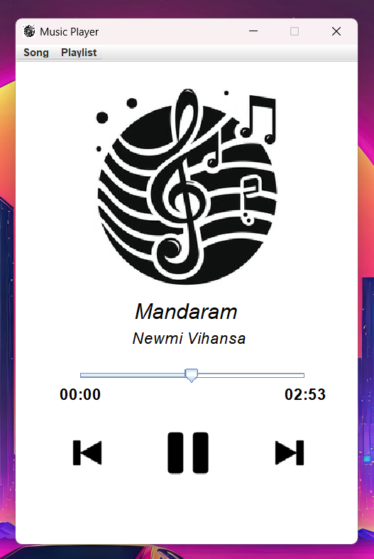

# MP3-Music-Player

A simple and intuitive MP3 Music Player built using Java.

## Technologies

- **Java**: The core programming language used.
- **JavaFX**: Used for creating the graphical user interface.
- **Mp3Magic**: A Java library for reading MP3 files and manipulating MP3 file ID3 tags.
- **JLayer**: MP3 decoder/player/converter library for the Java™ platform.
- **JAudioTagger**: Provides a world-class Java library for editing tag information in audio files.

## Features

- 🎶 **Play an MP3 File (Song)**
- 🎙 **Display Title of Song**
- 👤 **Display Artist of Song**
- ⏳ **Display the Length of the Song**
- ⏪ **Playback Functionality**
- ⏸ **Pause Song**
- ▶ **Resume Song**
- ⏭ **Go to next Song in a playlist**
- ⏮ **Go to previous Song in a playlist**
- 📃 **Create a Custom Playlist**
- 🔃 **Load a Custom Playlist**

## Setup

### Prerequisites

Ensure you have the following installed on your local machine:

- Java Development Kit (JDK) 8 or later
- A Java Integrated Development Environment (IDE) such as IntelliJ IDEA, Eclipse, or NetBeans

### Running the Application

To run the MP3 Music Player locally, follow these steps:

1. **Clone the repository** to your local machine:
   ```bash
   git clone https://github.com/your-username/mp3-music-player.git
   cd mp3-music-player
   ```
2. **Open the project** in your preferred Java IDE.
3. **Compile and run** the `App.java` file.
4. **Or you can run the `MP3-Music-Player.exe` file** in the `dist` folder.

## Screenshots

<div align="center">
  
</div>

## Original Source

- TapTap (YouTube) : [MP3 Music Player App - Java Beginner Project Tutorial](https://www.youtube.com/watch?v=xf0aH2K3oJ4&t=1s)


